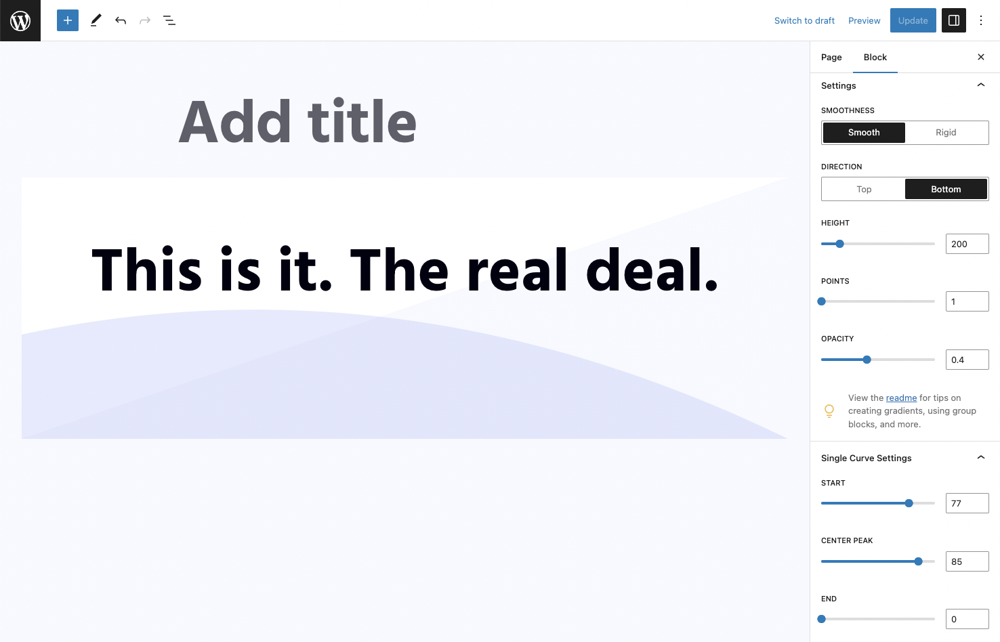

# Wavy Divider - A WordPress block

A colorful, fun, lightweight divider block to energize your website with character and pizazz

Generate and add a simple wavy divider to anywhere on your page, giving you the ability to separate blocks of content with an impressive, professional-looking design element.

View this block plugin [on WordPress.org](https://wordpress.org/plugins/wavy-divider)

### Features
- Color settings, including opacity.
- Choose between wide, normal, and full width
- Choose between rounded edges and stright lines
- Fine tune curves and lines with built-in controls
- Supports top or bottom shapes
- Stack multiple dividers with group block (see below)
- Gradients - easy to use (see below)
- Control height, number of points, and direction

### Gradients

To use a gradient, you need to wrap the wavy divider in a group block and apply the gradient to the group block. After that, create a wavy shape and apply a color that matches your content background (e.g. white). You can then switch the direction of the divider (under settings) to give a mirrored effect. This way the gradient is applied to the group block and the wavy divider acts as a mask.

### Group Block

If nesting the wavy divider in a group block, you may want to remove the padding and margins so that the wavy divider will not have spacing around it. To handle this, select the group block, and under "Advanced" (at the bottom of the settings area) add these two classes:

- `wavy-divider-remove-margin`
- `wavy-divider-remove-padding`

### Patterns

Within the block inserter, under the Patterns tab, select 'Wavy Divider' from the dropdown menu to view some special, custom-made wavy patterns. And depending on the time of year, seasonal designs too!
## Example Screenshots

