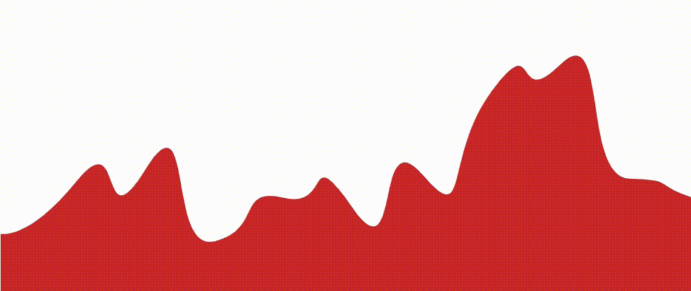

Wavy Divider - A WordPress block

A colorful, fun, lightweight divider block to energize your website with character and pizazz

This wavy SVG divider generator will let you add a simple wavy divider to anywhere on your page, giving you the ability to separate blocks of content with an impressive, professional-looking design element.

### Features
- Color settings
- Supports top or bottom shapes
- Stack multiple dividers with group block (see below)
- Gradients - easy to use (see below)

### Gradients

To use a gradient, you need to wrap the Wavy divider in a group block and apply the gradient to your group block. After that, you create a wavy shape and apply a color that matches your content background (e.g. white)

### Group Block

If nesting the wavy divider in a group block, you may want to remove the padding and margins so that the wavy divider will not have spacing around it. To handle this, select the group block, and under "Advanced" add these two classes:

- `wavvy-divider-remove-margin`
- `wavvy-divider-remove-padding`
